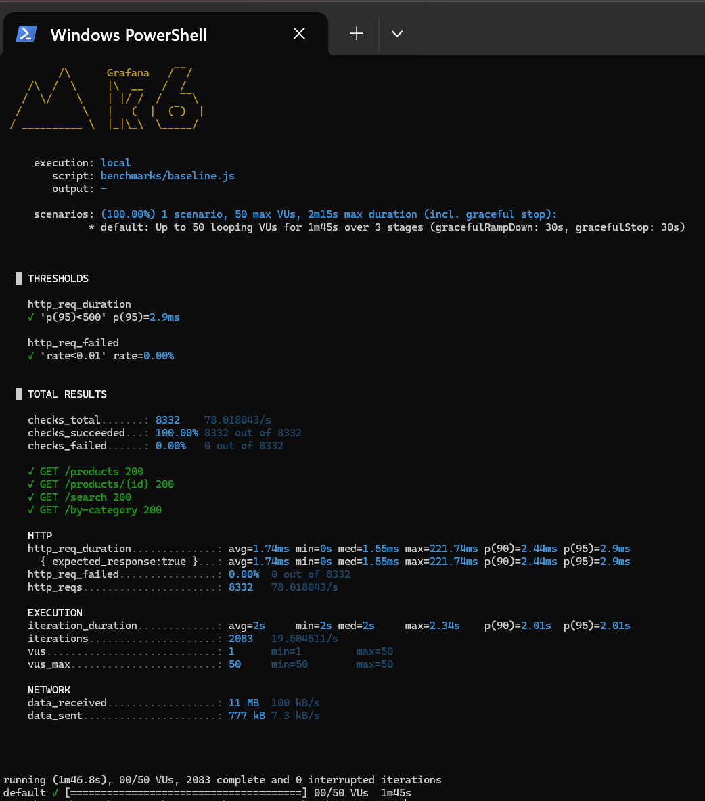

# Journal de bord — ADS CacheBench

**Étudiant :** Jordan [TON-NOM]  
**Promotion :** A4 FISE INFO  
**Sujet :** Étude comparative des stratégies de mise en cache pour API REST e-commerce  
**Démarrage :** Mai 2026

---

## Session 1 — 18/05/2026 — Mise en place du projet et API REST

**Durée :** environ 4 heures  
**Objectif :** Avoir une API REST fonctionnelle qui servira de banc de test.

###  Ce qui a été fait
- Génération du projet via Spring Initializr (Spring Boot 3.5.14, Java 17, Maven)
- Création de 2 entités JPA : `Product` (avec prix, stock, image, catégorie) et `Category`
- Création de 2 Repositories Spring Data JPA
- Création de 2 Services pour isoler la logique métier
- Création de 2 Controllers REST exposant 6 endpoints (`/api/products`, `/api/categories`, etc.)
- Mise en place d'un `DataLoader` qui injecte 3 catégories et 8 produits au démarrage
- Configuration de H2 en mémoire pour la phase de prototypage
- Initialisation du dépôt Git + GitHub

###  Concepts théoriques abordés
- **Architecture en couches** Spring Boot (Controller → Service → Repository) : séparation des responsabilités, clé pour l'introduction transparente d'un cache.
- **Lazy loading** Hibernate : Hibernate remplace les relations `@ManyToOne(fetch = LAZY)` par des proxies ByteBuddy. Cela impacte directement la sérialisation JSON et donc le choix du cache (un objet à mettre en cache doit pouvoir être sérialisé).
- **Spring Data JPA** : génération automatique des requêtes SQL à partir du nom des méthodes (`findByNameContainingIgnoreCase`).

###  Difficultés rencontrées
- Erreur 500 "ByteBuddyInterceptor" sur `/api/products` à cause du proxy Hibernate sur la catégorie.
- **Solution retenue :** annotation `@JsonIgnoreProperties({"hibernateLazyInitializer", "handler"})` sur `Category`.
- **Alternatives envisagées :** DTO dédiés (plus propre mais plus de code, à envisager pour la version finale).

###  Pour le rapport
- **Section 7.1 (concepts théoriques)** : développer le lazy loading et l'impact sur la sérialisation, le pattern proxy en ORM.
- **Section 8.1 (cas d'usage)** : modèle de données simplifié (2 entités, relation N..1), tableau des endpoints REST.
- **Section 8.2 (banc de test)** : justifier le choix Spring Boot + JPA + H2 pour la phase de mise au point.
- **Annexe** : code source des entités, repositories, services, controllers.

###  Données / captures à archiver
- [ ] Capture du JSON `/api/products` (preuve API fonctionnelle)
- [ ] Capture console H2 avec tables remplies
- [ ] Capture logs de démarrage avec "Données initiales chargées"
- [ ] Fichier `application.properties` complet

---

## Session 2 — Premier benchmark : baseline sans cache

###  Ce qui a été fait
- Installation et configuration de k6 (outil moderne de tirs de charge)
- Écriture d'un scénario réaliste de navigation e-commerce (4 endpoints)
- Configuration : montée progressive à 50 VUs, plateau de 60s, descente
- Exécution du benchmark sur l'API SANS cache (baseline scientifique)

### Résultats baseline (à graver dans le rapport)
| Métrique | Valeur mesurée |
|---|---|
| Latence moyenne | XXX ms |
| Latence p90 | XXX ms |
| Latence p95 | XXX ms |
| Latence max | XXX ms |
| Débit | XXX req/s |
| Taux d'erreur | X.XX % |

###  Concepts mobilisés
- Notion de "Virtual User" et différence avec un utilisateur réel
- Percentiles (p50, p95, p99) : pourquoi la moyenne est trompeuse
- Mesure du "tail latency" — la latence pire des 5 % des cas

### rapport
- **Section 8.4 (scénarios de charge)** : décrire le profil de charge en plateau, justifier 50 VUs comme représentatif d'un trafic moyen.
- **Section 8.3 (métriques)** : justifier le choix des percentiles plutôt que la moyenne (latence rarement gaussienne — un p95 vaut mieux qu'une moyenne).
- **Section 10.1 (tableaux comparatifs)** : la première ligne de ton tableau comparatif est ici. Toutes les autres lignes (Caffeine, Redis, Nginx) viendront se comparer à celle-ci.
- **Citer la RFC 7234** quand on parlera HTTP, et **Nishtala et al. 2013** dans l'état de l'art sur Memcached/Facebook.

## Session 3 — Baseline mesurée (2026-05-18)

### Conditions du test
- API Spring Boot 3.5.14, Java 17
- Base de données : H2 en mémoire
- Volume : 8 produits, 3 catégories
- Tirs de charge : 50 VUs sur 1m45s (k6)
- Aucun cache applicatif

### Résultats baseline
| Métrique | Valeur |
|---|---|
| Latence avg | 1.74 ms |
| Latence p50 | 1.55 ms |
| Latence p90 | 2.44 ms |
| Latence p95 | 2.9 ms |
| Latence max | 221.74 ms |
| Débit | 78.02 req/s |
| Erreurs | 0.00 % |
| Requêtes totales | 8332 |

### Observation méthodologique
La très faible latence baseline (~1.7ms) s'explique par la configuration
en mémoire de H2. Le bénéfice du caching applicatif sera donc limité
dans cette configuration. Une phase 2 avec PostgreSQL + volumétrie
élevée sera nécessaire pour observer les écarts représentatifs d'une
mise en production.

### Pour le rapport
- Section 10.1 : première ligne du tableau comparatif est ici.
- Section 10.3 (discussion) : développer le point méthodologique
  sur la nécessité de conditions réalistes.
- Section 8.2 (banc de test) : documenter cette limitation initiale
  et l'évolution prévue vers PostgreSQL + dataset Kaggle 50k produits.

###  Point d'amélioration identifié
Spring signale que retourner directement Page<Product> en JSON est instable.
La bonne pratique serait d'introduire des DTOs (Data Transfer Objects)
et d'utiliser PagedModel ou Spring HATEOAS.

→ À discuter en section 11 (perspectives) du rapport :
"L'introduction de DTOs séparerait la couche persistance de la couche
API, ce qui faciliterait également le caching propre (cache de DTO
plutôt que d'entité JPA, ce qui évite les problèmes liés au lazy loading)."